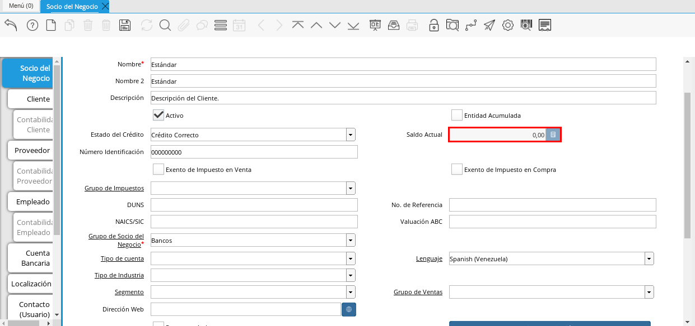

# **Socio del Negocio Cliente**

## **Definición de Socio del Negocio Cliente**

Un socio del negocio cliente es aquella persona, empresa u organización, que compra o adquiere los productos y servicios que necesita para su consumo o producción, a continuación se define el proceso para la creación de socio del negocio cliente en ADempiere.

### **Proceso de Registro del Socio del Negocio**

1. En el menú de ADempiere, ubique y seleccione la carpeta "**Relación con Socio del Negocio**", luego seleccione la carpeta "**Reglas de Socios del Negocio**" y finalmente seleccione la ventana "**Socio del Negocio**". 

    

#### **Ventana Socio del Negocio**

En esta ventana se registran los datos principales que la empresa requiere del socio del negocio cliente. Cada uno de los campos con el símbolo (*) son obligatorios para el registro.

1. A continuación visualizará la ventana "**Socio del Negocio**", dónde debe seleccionar el icono de "**Registro Nuevo**" que se encuentra ubicado en la barra de herramientas de ADempiere.

    

1. Proceda al llenado de los campos necesarios que a continuación se detallan.
    
    1. Seleccione en el campo "**Organización**", la organización para la cual se esta registrando el socio del negocio cliente.

        

        !!! warning "**Importante**"

            Para que el socio del negocio este disponible para todas las organizaciones, el mismo deberá estar registrado con la organización en (*) de lo contrario el socio del negocio solo estará disponible para una sola organización. 
    
    1. Introduzca el código de identificación, cédula o rif del socio del negocio en el campo "**Código**", el valor introducido en este campo automáticamente se reflejará en el campo "**Número Identificación**".
        
        
    
        !!! warning "**Importante**"

            Se recomienda que al ingresar el valor al campo "**Código**" no se ingrese ningún prefijo, punto, guion o cualquier otro carácter.

    1. Introduzca el nombre del socio del negocio cliente en el campo "**Nombre**".

        

    1. Introduzca el apellido del socio del negocio cliente en el campo "**Nombre 2**".

        

    1. Introduzca una breve descripción referente al socio del negocio cliente en el campo "**Descripción**".

        

    1. Seleccione el checklist "**Entidad Acumulada**", para definir al socio del negocio como entidad sumaria.

        

    1. Seleccione en el campo "**Estado de Crédito**", el estado del crédito que posee el socio del negocio cliente que esta registrando. Para ejemplificar el registro es utilizada la opción "**Crédito Correcto**".

        

    1. Podra visualizar el saldo actual que posee el cliente en el campo "**Saldo Actual**.

        

    1. Seleccione el checklist "**Exento de Impuesto en Venta**", para definir al socio del negocio como exento de impuesto.

        

    1. Seleccione el checklist "**Exento de Impuesto en Compra**", para definir al socio del negocio como exento de impuesto.

        

    1. Seleccione en el campo "**Grupo de Impuestos**", el grupo de impuestos.

        
    
    1. Introduzca en el campo "**DUNS**", el código DUNS del socio del negocio cliente.

        

    1. Introduzca en el campo "**No. de Referencia**", el número de socio del negocio cliente.

        

    1. Introduzca en el campo "**NAICS/SIC**", el código NAICS o SIC del socio del negocio cliente.

        

    1. Introduzca en el campo "**Valuación ABC**", la clasificación de importancia que posee el socio del negocio cliente.

        

    1. Seleccione en el campo "**Grupo de Socio del Negocio**", el grupo de socio del negocio al que pertenezca el socio del negocio cliente que esta registrando, para este ejemplo el grupo utilizado es "**Clientes Nacionales**".

        

    1. Seleccione en el campo "**Tipo de Cuenta**", el tipo de cuenta o negocio que posee el socio del negocio cliente.

        

    1. Seleccione en el campo "**Lenguaje**", el lenguaje a utilizar en los documentos que serán generados al socio del negocio cliente.

        

    1. Seleccione en el campo "**Tipo de Industria**", el tipo de industria que clasifica al socio del negocio empleado.

        

    1. Seleccione en el campo "**Segmento**", el segmento del socio del negocio cliente.

        

    1. Seleccione en el campo "**Grupo de Ventas**", el grupo de ventas del socio del negocio cliente. 

        

    1. Introduzca en el campo "**Dirección Web**", la dirección de la página web de contacto del socio del negocio cliente.

        

    1. Seleccione el checklist "**Prospecto Activo**" si el socio del negocio cliente es un prospecto activo.

        
    
    1. Seleccione la opción "**Liga Organización**", para integrar el socio del negocio a una organización.

        

    1. Introduzca en el campo "**Valor Esperado**", el total de los ingresos esperados por parte del socio del negocio cliente.

        

    1. Podrá visualizar en el campo "**Valor Total Transacciones**", el monto total de la primera venta realizada al socio del negocio cliente.

        
    
    1. Introduzca en el campo "**Costo de Adquisición**", el costo asociado con hacer de este prospecto un cliente.

        

    1. Introduzca en el campo "**Empleados**", la cantidad de empleados que posee el socio del negocio cliente.

        

    1. Introduzca en el campo "**Participación**", el porcentaje del socio del negocio cliente.

        

    1. Seleccione en el campo "**Tipo de Persona**, el tipo de persona al que pertenece el socio del negocio que esta registrando, este campo obligatorio permite la configuración esencial de las retenciones. Para ejemplificar el registro es utilizada la opción "**Persona Jurídica Domiciliada**".

        

    1. Introduzca en el campo "**Volumen de Ventas**", el número de ventas total para un socio del negocio.

        

    1. Podrá apreciar en el campo "**Primera Venta**", la fecha de la primera venta realizada al socio del negocio cliente.

        

    1. Seleccione en el campo "**Logo**", el logo de la empresa del socio del negocio cliente que esta registrando.

        

    1. Seleccione el icono "**Guardar Cambios**" ubicado en la barra de herramientas para guardar los datos ingresados.

        

!!! warning "**Importante**"

    Recuerde guardar el registro de los campos cada vez que se vaya a posicionar en una pestaña de la ventana socio del negocio. 

##### **Pestaña Cliente**

En esta pestaña es registrada la información que la empresa requiere del socio del negocio cliente al momento de una venta al mismo. Cada uno de los campos que la misma contiene son necesarios en algún punto de la transacción de ventas.

1. Seleccione la pestaña "**Cliente**" que se encuentra del lado izquierdo de la ventana socio del negocio. 

    

1. A continuación visualizará la siguiente imagen, dónde debe tildar el checklist "**Cliente**". 

    

    !!! warning "**Importante**"

        Al tildar el checklist "**Cliente**", podrá apreciar diferentes campos que establecen los términos o reglas para las transacciones de ventas al socio del negocio cliente que esta registrando. Dichos campos no son obligatorios porque pueden ser establecidos al momento de generar la orden de venta al socio del negocio.

    1. Introduzca en el campo "**Copias del Documento**", el número de copias a ser impresas de cada documento generado al socio del negocio cliente.

        

    1. Seleccione en el campo "**Regla de Facturación**", la regla establecida para facturar al socio del negocio cliente.

        

    1. Seleccione en el campo "**Programa de Facturación**", la frecuencia usada cuando se generan las facturas.

        
    
    1. Seleccione en el campo "**Regla de Entrega**", la regla establecida para entregar al cliente los productos o servicios.

        

    1. Seleccione en el campo "**Vía de Entrega**", como serán entregados los productos o servicios de la orden.

        

    1. Seleccione en el campo "**Lista de Precios**", la lista de precios establecida para las ventas al socio del negocio cliente que esta registrando.

        

    1. Seleccione en el campo "**Esq List Precios/Desc**", el esquema para calcular el porcentaje de descuento comercial.

        

    1. Podrá apreciar en el campo "**% Descuento**", el porcentaje de descuento configurado en el esquema de descuento.

        

    1. Seleccione en el campo "**Regla de Pago**", la forma de pago de las facturas establecida para el socio del negocio cliente que esta registrando.

        
    
    1. Seleccione en el campo "**Término de Pago**", las condiciones de pago de las facturas establecida para el socio del negocio que esta registrando.

        

    1. Seleccione en el campo "**Agente Comercial**", asignado a la región donde se encuentra el socio del negocio cliente.

        

    1. Seleccione en el campo "**Morosidad**", la regla de morocidad para facturas vencidas.

        

    1. Introduzca en el campo "**Referencia de Orden de Socio del Negocio**", el número estándar de referencia para las órdenes de compra.

        

    1. Seleccione el checklist "**Imprimir Descuento**", si desea imprimir en la factura y en la orden de venta el descuento aplicado.

        

    1. Introduzca en el campo "**Descripción de Orden**", una descripción estándar para se utilizadas en las órdenes a generar al socio del negocio cliente que esta registrando.

        

    1. Seleccione en el campo "**Formato de Impresión**", el formato de impresión a utilizar en las facturas del socio del negocio cliente. 

        

    1. Introduzca en el campo "**Mín de Vida útil %**", tiempo mínimo de vida útil que tienen los productos.

        

    1. Introduzca en el campo "**Límite de Crédito**", el límite de crédito establecido para el socio del negocio cliente que esta registrando.

        

    1. Podrá visualizar en el campo "**Crédito Usado**", el crédito usado por el socio del negocio cliente que esta registrando.

        

    1. Introduzca en el campo "**Tiempo Gracia Cobro**", los días de gracia que tiene el socio del negocio antes de que el agente comercial le realice el cobro.

         

##### **Pestaña Cuenta Bancaria**

En esta pestaña se registran los datos bancarios del socio del negocio cliente, con el checklist "**Activo**" se pueden registrar los datos de la tarjeta de crédito del socio del negocio. Así mismo, con el checklist "**ACH**" se pueden registrar los datos de la cuenta bancaria del socio del negocio.

1. Seleccione la pestaña "**Cuenta Bancaria**" que se encuentra ubicada del lado izquierdo de la ventana socio del negocio. Por defecto se encuentra tildado el checklist "**Activo**".

    

###### **Checklist Activo**

1. Seleccione en el campo "**Tarjeta de Crédito**", el tipo de tarjeta de crédito que posee el socio del negocio cliente que esta registrando.

    

1. Introduzca en el campo "**Número**", el número de tarjeta de crédito del socio del negocio cliente que esta registrando.

    

1. Introduzca en el campo "**Código Verificación**", el código de verificación de la tarjeta de crédito del socio del negocio cliente que esta registrando, este código son los últimos tres números del reverso de la tarjeta.

    

1. Introduzca en el campo "**Mes de Expiración**", el mes de expiración de la tarjeta de crédito del socio del negocio cliente que esta registrando.

    

1. Introduzca el año de expiración de la tarjeta de crédito del socio del negocio cliente que esta registrando en el campo "**Año de Expiración**".

    

    !!! warning "**Importante**"

        Este proceso se realiza con la finalidad de registrar la tarjeta de crédito del socio del negocio. 

###### **Checklist ACH**

1. Para registros de cuentas bancarias, tilde el checklist "**ACH**", a continuación se reflejarán los campos para el registro de la cuenta bancaria del socio del negocio.

    

1. Introduzca en el campo "**IBAN**", el código IBAN conformado por el código del país (2 dígitos) más el código de control de la localidad donde se encuentra la sucursal del banco (2 dígitos). Para ejemplificar el registro es utilizado el código "**VE21**".

    

1. En el campo "**Banco**" seleccione el banco a registrar con ayuda del ícono identificador (adjunto imagen).

    

    1. A continuación visualizará la siguiente ventana con los diferentes bancos, dónde debe seleccionar el banco que posee el socio del negocio cliente y la opción "**OK**" para cargar los datos al formulario.

        

1. Seleccione el tipo de cuenta correspondiente a la cuenta del socio del negocio cliente en el campo "**Tipo de Cuenta Bancaria**".

    

1. Introduzca en el campo "**No. De Cuenta**", el número de cuenta del socio del negocio cliente que esta registrando.

    

    !!! warning "**Importante**"

        Este proceso se realiza con la finalidad de registrar la cuenta del socio del negocio. 

1. Introduzca el nombre de referencia en el campo "**Nombre**", en este campo va el nombre del titular de la tarjeta de crédito o de la cuenta bancaria que esta registrando.

    

1. Introduzca en el campo "**Dirección**", la dirección de la entidad bancaria poseedora de la tarjeta de crédito.

    

1. Introduzca en el campo "**Ciudad**", el nombre de la ciudad donde se encuentra la entidad bancaria poseedora de la tarjeta de crédito.

    

1. Introduzca en el campo "**Código Postal**", el código postal de la ciudad donde se encuentra la entidad bancaria poseedora de la tarjeta de crédito.

    

1. Introduzca en el campo "**Estado**", el nombre del estado donde se encuentra la entidad bancaria poseedora de la tarjeta de crédito.

    

1. Introduzca en el campo "**País Cuenta**", el nombre del país donde se encuentra la entidad bancaria poseedora de la tarjeta de crédito.

    

1. Introduzca en el campo "**Licencia de Conducir**", el número de licencia de conducir del socio del negocio cliente que esta registrando.

    

1. Introduzca en el campo "**No. Seguro Social**", el número de cédula del titular de la tarjeta de crédito o cuenta bancaria que esta registrando.

    

1. Introduzca en el campo "**Cta. Correo Electrónico**", el correo electrónico asociado a la tarjeta de crédito o cuenta bancaria que esta registrando.

    

1. Seleccione en el campo "**Dirección Verificada**", si la dirección de la entidad bancaria se encuentra verificada.

    

1. Seleccione en el campo "**Código Postal Verificado**", si el código postal de la entidad bancaria se encuentra verificado.

    

##### **Pestaña Localización**

La localización de un socio del negocio cliente es muy importante por diferentes motivos, ya que las transacciones de ventas serán realizadas al mismo, en esta pestaña se deben registrar con exactitud los datos de la dirección del socio del negocio.

1. Seleccione la pestaña "**Localización**" que se encuentra ubicada del lado izquierdo de la ventana socio del negocio.

    

1. Introduzca en el campo "**Localización / Dirección**", la dirección de localización del socio del negocio cliente con ayuda del identificador.

    

    1. Seleccione en el campo "**País**", el país donde se encuentra domiciliado el socio del negocio que esta registrando.

        

    1. Seleccione en el campo "**Estado**", el estado donde se encuentra domiciliado el socio del negocio que esta registrando.

        

    1. Seleccione en el campo "**Ciudad**", la ciudad donde se encuentra domiciliado el socio del negocio que esta registrando.

        

    1. Introduzca la dirección detallada del socio del negocio cliente en el campo "**Dirección 1**" y seleccione la opción "**OK**".

        

1. Introduzca en el campo "**Teléfono**", el número de teléfono local para contactar al socio del negocio cliente.

    

1. Introduzca en el campo "**Teléfono Móvil**", el número de teléfono móvil para contactar al socio del negocio cliente.

    

1. Introduzca en el campo "**Fax**", el fax para contactar al socio del negocio cliente.

    

1. Introduzca en el campo "**ISDN**", el ISDN para contactar al socio del negocio cliente.

    

1. Podrá apreciar tildados los checklist "**Dirección Entregar-A**", "**Dirección Facturar-A**", "**Dirección Pagar-Desde**" y "**Dirección Remitir-A**", indicando cada uno de ellos un comportamiento diferente.

    1. El checklist "**Dirección Entregar-A**" establece la localización ingresada como la dirección para embarcar los bienes.

        

    1. El checklist "**Dirección Facturar-A**" establece la localización ingresada como la dirección para facturar.

        

    1. El checklist "**Dirección Pagar-Desde**" establece la localización ingresada como la dirección desde donde paga las facturas el socio del negocio y donde son enviadas las cartas de morosidad.

        

    1. El checklist "**Dirección Remitir-A**" establece la localización ingresada como la dirección para el envío de los pagos.

        

1. Seleccione en el campo "**Región de Ventas**", la región o área de ventas en la que se encuentra localizado el socio del negocio cliente.

    

1. Introduzca en el campo "**Código SICA**", el código SICA del socio del negocio cliente.

    

!!! warning "**Importante**"
                
    Recuerde guardar el registro de los campos cada vez que se vaya a posicionar en una pestaña de la ventana socio del negocio.

##### **Pestaña Contacto**

En esta pestaña se registran todos los datos de contacto que se posea el socio del negocio cliente. De igual manera, es creado su usuario de acceso en ADempiere.

1. Seleccione la pestaña "**Contacto**" que se encuentra ubicada del lado izquierdo de la ventana socio del negocio, para proceder a llenar los campos necesarios.

    

    !!! warning "**Importante**"

        El contacto (Usuario) permite registrar las diferentes personas de contacto que tiene la empresa con el socio del negocio cliente que esta registrando. Un ejemplo de esta pestaña puede ser, un jefe o persona de contacto por departamento para que a la hora de alguna venta de productos o servicios al socio del negocio cliente, se contacte a la persona correspondiente.

    1. Introduzca en el campo "**Nombre**", el nombre completo de la persona de contacto con el socio del negocio cliente que esta registrando.

        

    1. Introduzca en el campo "**Descripción**", una breve descripción de la persona de contacto con el socio del negocio cliente que esta registrando.

        

    1. Introduzca en el campo "**Comentarios**", los comentarios o información adicional sobre el registro de la persona de contacto con el socio del negocio cliente.

        

    1. El checklist "**Activo**", indica que el registro se encuentra activo en el sistema.

        

    1. Seleccione el checklist "**Es Gerente de Proyecto**", para indicar que la persona de contacto con el socio del negocio cliente es gerente de proyecto.

        

    1. Seleccione el checklist "**Es Miembro de un Proyecto**", para indicar que la persona de contacto con el socio del negocio cliente es miembro de un proyecto.

        

    1. Seleccione el checklist "**Usuario de Autenticación**" para que sean reflejados los campos necesarios para crear el usuario del socio del negocio cliente.

        

        1. Seleccione el checklist "**Usuario Interno**", para indicar que la persona de contacto con el socio del negocio cliente es usuario interno.

            

        1. Introduzca en el campo **Código**, el usuario de la persona de contacto con el socio del negocio cliente para ingresar a ADempiere. 

            

            !!! warning "**Importante**"

                ERP tiene establecido como estándar de creación de usuario y contraseña en ADempiere, la inicial del primer nombre en minúscula, seguido del primer apellido completo, con la primera letra del mismo en mayúscula.

        1. Introduzca en el campo "**Contraseña**", la contraseña de la persona de contacto con el socio del negocio cliente para ingresar a ADempiere.

            

            !!! warning "**Importante**"

                ERP tiene establecido como estándar de creación de usuario y contraseña en ADempiere, la inicial del primer nombre en minúscula, seguido del primer apellido completo, con la primera letra del mismo en mayúscula.

        1. Seleccione el checklist "**Usuario de Tienda Web**", para indicar que la persona de contacto con el socio del negocio es usuario de tienda web.

            

    1. Introduzca en el campo "**Email**", el correo electrónico de la persona de contacto con el socio del negocio para las transacciones entre las empresas.

        

    1. Seleccione en el campo "**Saludo**", la forma de saludar a la persona de contacto con el socio del negocio en los documentos a ser enviados.

        

    1. Seleccione en el campo "**Dirección del Socio del Negocio**, la dirección de ubicación de la persona de contacto con el socio del negocio.

        

    1. Introduzca en el campo "**Título**", el nombre del socio del negocio cliente.

        

    1. Seleccione en el campo "**Cumpleaños**", la fecha de nacimiento de la persona de contacto con el socio del negocio.

        

    1. Introduzca en el campo "**Teléfono**", el teléfono para localizar a la persona de contacto con el socio del negocio para las transacciones entre las empresas.

        

    1. Introduzca en el campo "**Teléfono Móvil**", el teléfono móvil para localizar a la persona de contacto con el del socio del negocio.

        

    1. Introduzca en el campo "**Fax**", el fax de contacto del socio del negocio.

        

    1. Seleccione en el campo "**Tipo de Notificación**", la forma de enviar notificaciones a la persona de contacto con el socio del negocio.

        

    1. Seleccione en el campo "**Posición**", la posición de trabajo de la persona de contacto con el socio del negocio.

        

    1. Podrá apreciar el checklist "**Acceso Total Socio del Negocio**", que al estar tildado indica que la persona de contacto con el socio del negocio cliente posee acceso total a su rol.

        

    1. Seleccione el icono "**Guardar Cambios**" en la barra de herramientras de ADempiere, para guardar el registro de los campos.

        

!!! note "**NOTA:**"
        
    Este procedimiento realizado aplica solo para los **Socios del Negocio** que cumplan el rol de **Cliente**.
